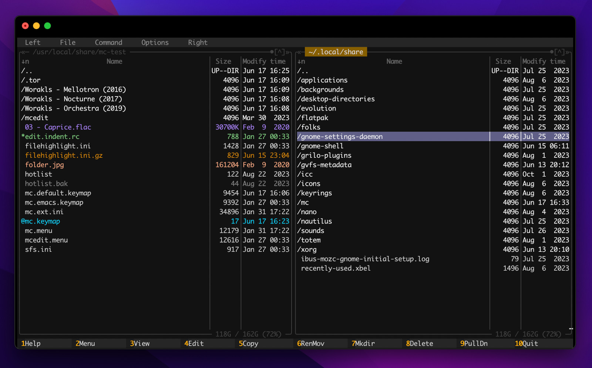

<h3 align="center">
	<br/>	
	MashDark for <a href="https://midnight-commander.org/">Midnight Commander</a>	
</h3>
<p align="center">
    <a href="https://github.com/notnout/mashdark/stargazers"></a>
    <a href="https://github.com/notnout/mashdark/issues"></a>
    <a href="https://github.com/notnout/mashdark/contributors"></a>
</p>

<p align="center">
  
</p>

## MashDark - finally a good looking mc skin 
MashDark provides a modern dark skin for [midnight commander](https://github.com/MidnightCommander/mc) - a surprisingly powerfull file manager for commandline that is better than many of visual apps (and you can use it both locally and over ssh on your server). 
MashDark skin is using couple tricks in comparison with existing `mc` skins to make it look better (e.g. it styles border lines with different color than the foreground text). <br/>
*Note: Requires `mc` version 4.8 or newer. Install with e.g. `sudo apt install mc`* <br/>
*Note: I hope that `mc` adds the needed bindings asap so these hacks are not needed in future.*
### Installation (on Mac and Linux)
#### Install using GIT
```sh
mkdir -p ~/mashdark ; cd ~/mashdark
git clone https://github.com/notnout/mashdark.git

mkdir -p ~/.local/share/mc/skins ~/.config/mc
mv ~/.config/mc/filehighlight.ini{,.old}
cp mashdark.ini ~/.local/share/mc/skins/mashdark.ini
cp filehighlight.ini ~/.config/mc/filehighlight.ini
```
#### Install Manually
1. Download the latest skin [raw file](https://raw.githubusercontent.com/notnout/mashdark/mashdark.ini) and save it as `~/.local/share/mc/skins/mashdark.ini`
2. Download the latest highlight [raw file](https://raw.githubusercontent.com/notnout/mashdark/master/filehighlight.ini) and save it as `~/.config/mc/filehighlight.ini`
#### Activate the Theme
- **Option 1:** Choose the skin in the mc UI: Options → Appearance → Skin … and select this skin. 
- **Option 2:** Update your mc settings: edit `~/.config/mc/ini` and add `skin=mashdark` to the `[Midnight-Commander]` section.
#### Configuring the MC UI 

### Update
```sh
cd ~/mashdark
git pull
cp mashdark.ini ~/.local/share/mc/skins/mashdark.ini
cp filehighlight.ini ~/.config/mc/filehighlight.ini
```
### Summary of files
- `mashdark.ini`
	- This is the skin file. 
- `filehighlight.ini`
	- In this file we add new file type `[any]` on the bottom. This allows us to style file names differently than the border (I really wish mc would actually provide binding for this), and this then allows us to style the borders with different color than the file names. 
## Screenshots
- Menu
- Diff
- Editor
### References
- see skin viewer/editor https://phplego.github.io/mc/
- colors: https://misc.flogisoft.com/bash/tip_colors_and_formatting 
- mc skin params: https://github.com/MidnightCommander/mc/blob/master/lib/skin/colors.c
- another decent dark skin: https://draculatheme.com/midnight-commander- 
- tutorial: https://www.youtube.com/watch?v=fJOkuaihAek 
